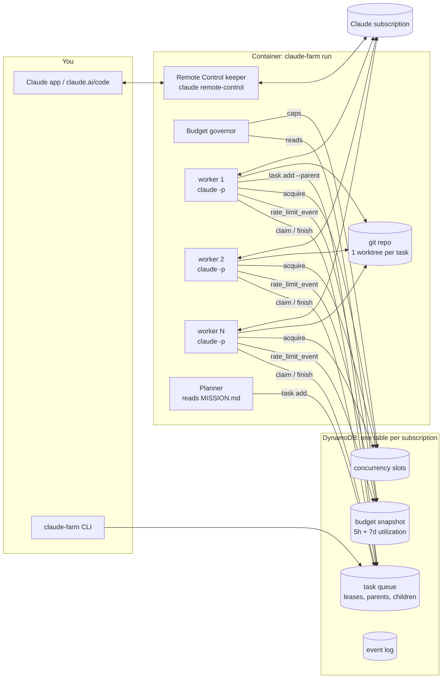

# claude-farm

**Always-on Claude Code agents in a container, on your own Claude subscription.**

claude-farm runs Claude Code around the clock inside a Docker container. It keeps a
[Remote Control](https://docs.claude.com/en/docs/claude-code/remote-control) session open so you can steer it from the
Claude app on your phone. It also runs a pool of headless agents that take tasks from a DynamoDB queue and split big
jobs into parallel sub-agents. A budget governor paces all of it against your plan's real 5-hour and weekly limits
(or a daily dollar cap on an API key), so the agents stay out of your way when you want Claude yourself.

It is the first open-source piece of **Pluribus**, a self-evolving company run by a swarm of Claude agents. This repo
is the engine that keeps a swarm like that working. There is no web panel: you use the Claude app, a CLI and the logs.

```
$ claude-farm status
claude-farm 0.1.0  farm claude-farm@a1b2c3  table claude-farm
BUDGET (account-wide, from Claude Code's own rate-limit reports)
  5-hour    41% used   limit for agents 85%   resets Thu 18:00Z (in 2.3h)
  7-day     38% used   limit for agents 80%   resets Mon 07:00Z (in 3.1d)
  status  allowed   measured 12s ago
GOVERNOR  3/3 agents allowed now: within budget: full speed
QUEUE     queued 4  running 3  waiting 1  done 57  failed 1
```
*(Illustrative output.)*

---

## Why

You want Claude Code working on a long-running project while you're away. A laptop that sleeps can't do that. A
naive `while true; claude -p` loop has no memory of what it was doing, no way to split work, and no sense of your
limits: it runs until it hits the wall and locks you out of your own Claude.

claude-farm handles those parts:

| | |
|---|---|
| **Always on** | A container on any Linux box or a small EC2 instance. Workers restart, leases expire, crashed runs are re-queued. |
| **Budget as a whole** | Every agent run reports the account's real utilization (Claude Code's `rate_limit_event`). The governor paces the week, leaves you 20% of it by default, pauses before a 5-hour window fills, and sleeps until the reset when rejected. It never draws on paid overage unless you allow it. With an API key it enforces a daily dollar cap instead. |
| **Keeps working** | When the queue runs dry, a planner agent reads your `MISSION.md` and what was done so far, then queues the next tasks. |
| **Sub-agents** | Any agent can run `claude-farm task add --parent $FARM_TASK_ID ...` to fan out. Sub-agents run in parallel in their own git worktrees, and the parent is resumed *in its own session* with their results. |
| **Checked before it lands** | Set `FARM_VERIFY_CMD` (e.g. `pytest -q`). A finished task is rebased onto main and the check runs. If it fails, the agent is resumed *in its own session* with the failure output, and nothing reaches main until the check passes. |
| **Fails safely** | A timed-out run continues in its session instead of starting over. N failed runs in a row trip a circuit breaker that pauses every box. `FARM_NOTIFY_URL` (ntfy, Slack or Discord) tells you when a task fails, the farm pauses, a limit hits, or the mission is done. |
| **Steerable from your phone** | `claude remote-control` stays up, so the farm shows up in the Claude app and at claude.ai/code. |
| **Many boxes, many Claude accounts, one farm** | Point any number of containers at the same DynamoDB table, each logged in to its own account (yours, a teammate's Team seat). They share one queue and one git origin, but **every account gets its own budget**: the governor paces each seat on its own real usage, so when one seat hits a limit, the others keep working. See [docs/multi-seat.md](docs/multi-seat.md). |

## Quick start (local, no AWS account needed)

```bash
git clone https://github.com/matank001/claude-farm && cd claude-farm
cp .env.example .env
docker compose up -d                     # claude-farm + a bundled DynamoDB Local
docker exec -it claude-farm claude-farm login  # prints a URL: open it, approve, paste the code
```

Then give it something to do:

```bash
docker exec -it claude-farm bash -c 'cat > /workspace/repo/MISSION.md <<EOF
# Mission
Build a small, well-tested CLI that converts CSV to Markdown tables. Keep a CHANGELOG.
EOF'
docker exec claude-farm claude-farm task add "Add a --align flag" --prompt "Add a --align left|right|center flag, with tests."
docker exec claude-farm claude-farm status
docker logs -f claude-farm
```

Or open the **Claude app → Code**, pick the session named `claude-farm`, and talk to it.

Want the agents to work on a real repo? Set `FARM_REPO_URL` in `.env` (plus a deploy key if it's private).
The farm clones it into `/workspace/repo` and pushes `main` after each finished task.

## Deploy on AWS (about 10 minutes, one box, no open ports)

```bash
deploy/aws/deploy.sh up          # CloudFormation: VPC, EC2 t4g.medium, DynamoDB table, IAM role (only that table)
deploy/aws/deploy.sh login       # over SSM Session Manager: URL + code, same as local
deploy/aws/deploy.sh status
```

You need the AWS CLI v2 and the
[Session Manager plugin](https://docs.aws.amazon.com/systems-manager/latest/userguide/session-manager-working-with-install-plugin.html).
The box has **no inbound ports**: Remote Control, the Claude API and SSM all use outbound HTTPS. See
[docs/deploy-aws.md](docs/deploy-aws.md). Any other Linux host works too: `docker compose up -d`, then
`ssh -t host docker exec -it claude-farm claude-farm login`.

## One farm, several Claude accounts

```bash
deploy/aws/deploy.sh up --workspace-repo git@github.com:you/repo.git                 # box 1: creates the farm (table "claude-farm")
STACK=farm-gil deploy/aws/deploy.sh up --table claude-farm --workspace-repo git@github.com:you/repo.git
STACK=farm-gil deploy/aws/deploy.sh login                                             # Gil logs in to HIS account
claude-farm budget                                                                     # every seat, its usage, what it may run
```
- **Shared across boxes:** the queue, and the git origin, so a sub-task can run on Gil's box and be merged by a
  parent on yours.
- **Separate per seat:** the budget, usage snapshots and concurrency slots.
- **Sessions:** a resumed parent waits a few minutes for the box that holds its conversation.
- **Terms:** use Team/Enterprise seats for people working together, each person on their own login. Details and
  the terms in [docs/multi-seat.md](docs/multi-seat.md).

## Logging in (the part people ask about)

Your login never leaves the container's `claude-home` volume, and claude-farm never reads or prints it. Pick one:

| | How | Good for |
|---|---|---|
| **A. Log in remotely** | `docker exec -it claude-farm claude-farm login`, which runs `claude auth login`. It prints a URL: open it on your phone or laptop, approve, paste the code back. | Servers. This is the default. |
| **B. Token** | Run `claude setup-token` on your own computer and put `CLAUDE_CODE_OAUTH_TOKEN=...` in `.env`. | Headless workers, CI. Remote Control may need the full login from A. |
| **C. Existing profile** | Mount a Linux machine's `~/.claude` at `/home/farm/.claude`. | Moving a box. macOS keeps the login in the Keychain, so use A or B there. |
| **D. API key** | `ANTHROPIC_API_KEY=...` plus `FARM_DAILY_BUDGET_USD=20` in `.env`. Pay per token; the governor enforces the daily cap. | Teams, services, anything beyond one person's use. |

Until it's logged in, the container waits and prints these instructions in `docker logs`. Details and caveats:
[docs/auth.md](docs/auth.md).

## How it works



1. **A worker loop** asks the governor how many agents may run *right now* across every container on this account,
   takes a slot, claims the highest-priority task (atomic conditional write, with a lease it keeps renewing), and
   starts `claude -p --output-format stream-json` in the task's own git worktree.
2. **While it runs**, every `rate_limit_event` is written to the shared budget snapshot, so all workers everywhere
   react within seconds.
3. **When it ends**, the branch is rebased onto `main` and fast-forwarded in (pushed if there's an `origin`). A
   conflict becomes a new "resolve merge conflict" task.
   - If the agent queued sub-tasks, the parent waits. It's resumed with `--resume <its session>` once they're all
     done, so it keeps its full context.
   - A usage-limit rejection hands the attempt back and pauses everything until the reset.
4. **When the queue is empty** and there's budget, a single planner run (single-flight across all boxes, with
   back-off when it finds nothing to do) turns `MISSION.md` into the next tasks.

Deep dive: [docs/architecture.md](docs/architecture.md) · budget maths: [docs/budget.md](docs/budget.md) · what
agents are told: [docs/agents.md](docs/agents.md).

## The budget governor in one paragraph

Utilization numbers come from Claude Code itself and cover the **whole account**, including your own chats and
sessions, so the farm backs off when you use Claude. With several accounts in one farm, each seat is paced
separately on its own numbers.
- **Weekly window:** agents stop at 80% of the window by default, so the rest stays yours. The governor follows a
  pace line (`target × fraction of the week elapsed + 5%`). Ahead of the line it slows down or stops until the line
  catches up; behind it, it runs at full concurrency.
- **5-hour window:** it never goes past 85%, with a loose pace so short bursts are fine.
- **Rejected:** a rejection or paid overage stops everything until the reset time Claude reported.
- **API key:** no subscription windows apply, so it stops for the day at `FARM_DAILY_BUDGET_USD`.

All thresholds are in `.env`. The governor is a pure function with unit tests: [claude_farm/governor.py](claude_farm/governor.py).

## Commands

| Command | |
|---|---|
| `claude-farm status` | budget, queue, workers, running tasks |
| `claude-farm budget [--refresh]` | every seat's utilization and the governor's decision for it (`--refresh` measures this box's seat) |
| `claude-farm task add TITLE --prompt ... [--parent ID] [--priority 0-9]` | queue work (agents use the same command) |
| `claude-farm task list / show ID / cancel ID / retry ID` | inspect and manage tasks |
| `claude-farm events [-f]` | the event log (claims, merges, pauses, rate limits) |
| `claude-farm pause [reason]` / `resume` | stop and restart new work on every box sharing the table |
| `claude-farm login / whoami / doctor` | login and a setup check |

Everything takes `--json`.

## Configuration

All settings are environment variables. [.env.example](.env.example) documents every one. The ones you'll touch:

| Variable | Default | |
|---|---|---|
| `FARM_MAX_WORKERS` | `3` | upper bound on parallel agents per container; the governor decides the actual number |
| `FARM_MODEL` | `opus` | model for every agent |
| `FARM_WEEKLY_TARGET` | `0.80` | agents stop at 80% of the weekly window; the rest is yours |
| `FARM_FIVE_HOUR_CEILING` | `0.85` | max share of a 5-hour window the agents may use |
| `FARM_DAILY_BUDGET_USD` | `0` | API-key mode: daily spend cap (0 = none) |
| `FARM_REPO_URL` | *(empty)* | git repo to work in; empty means a fresh local repo |
| `FARM_PERMISSION_MODE` | `bypassPermissions` | the container is the sandbox; see [docs/security.md](docs/security.md) |
| `FARM_REMOTE_CONTROL` | `1` | keep a Remote Control session up |
| `FARM_VERIFY_CMD` | *(empty)* | check that must pass before a task lands on main, e.g. `python -m pytest -q` |
| `FARM_NOTIFY_URL` | *(empty)* | ntfy topic, Slack or Discord webhook for failures, pauses, limits and "nothing left to do" |
| `FARM_STALL_THRESHOLD` | `5` | failed runs in a row that pause the farm (circuit breaker) |
| `FARM_EFFORT` | *(default)* | `--effort` for every agent (`low` … `max`) |

## Related projects (and what we took from them)

- [ralph-claude-code](https://github.com/frankbria/ralph-claude-code) runs one Claude Code loop until the project is
  done, with a circuit breaker and careful exit detection. From its bug history we took three rules:
  - usage-limit detection must never trust the agent's own text;
  - a timeout is not a limit;
  - a timed-out run should keep its progress.
- [continuous-claude](https://github.com/AnandChowdhary/continuous-claude) is a loop that opens a PR per iteration
  and merges only when CI passes. That's the idea behind `FARM_VERIFY_CMD`.
- [sleepless-agent](https://github.com/context-machine-lab/sleepless-agent) is a 24/7 daemon with a task queue and
  Slack control, which throttles on `claude /usage`.
- There are also several small images that keep `claude remote-control` running in a container.

claude-farm puts these together into one self-hosted system:
- parallel workers;
- a parent/sub-agent task tree that resumes parents in their own session;
- one governor that paces the real 5-hour and weekly windows across every box sharing a table;
- a no-inbound-port cloud deploy.

## Is this allowed?

claude-farm drives the official Claude Code CLI, headless mode and Remote Control as documented. On a subscription it
is meant for **your own** projects, on your own account. Anthropic's consumer terms say plan limits assume ordinary,
individual usage, and they forbid reselling or intermediating Claude usage. So:
- don't run claude-farm as a service for other people on a subscription;
- don't share one login;
- for team or commercial workloads use an API key (option D) or your organisation's plan.

claude-farm never shares or rotates logins and never moves one account's limits onto another. Each seat is
paced on its own usage, and the governor exists to stay well under the limits.
Read the current [Consumer Terms](https://www.anthropic.com/legal/consumer-terms) and
[Usage Policy](https://www.anthropic.com/legal/aup) yourself; this README isn't legal advice.

## Security, in short

- The agents have full shell access **inside the container**, and that's the point, so only mount what they may
  change.
- They can reach the network. Give the container only the credentials it needs, e.g. a deploy key for one repo.
- The AWS deploy has no inbound ports, and its IAM role can touch only its own DynamoDB table.
- The agent guide tells agents never to print or commit credentials, send messages, spend money or post publicly
  unless your `MISSION.md` explicitly says so. A prompt is not a security boundary, though: see
  [docs/security.md](docs/security.md).

## Status

Early (0.1). The core loop, governor, sub-agents and AWS deploy are tested (`pytest`, plus a real-Claude run
recorded in [docs/testing.md](docs/testing.md)). Expect rough edges and please open issues. Contributions welcome:
[CONTRIBUTING.md](CONTRIBUTING.md).

*claude-farm is an independent open-source project, not affiliated with or endorsed by Anthropic. "Claude" and "Claude
Code" are trademarks of Anthropic, PBC.*

## License

MIT
