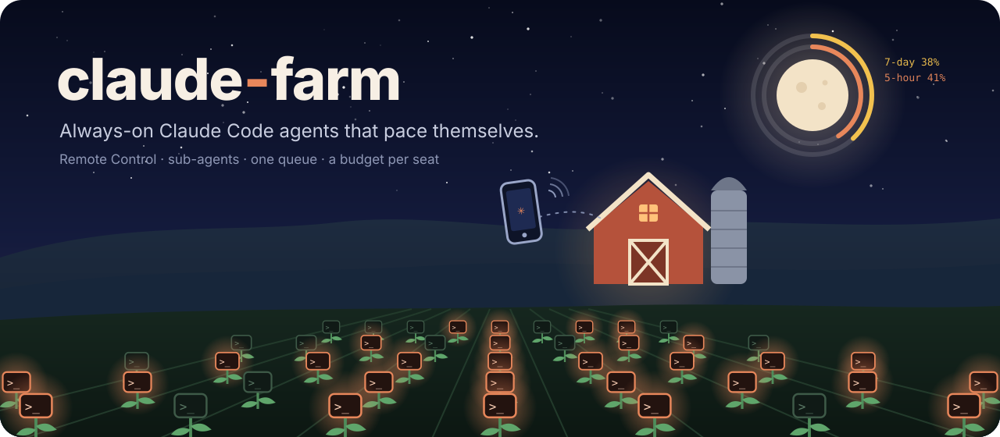
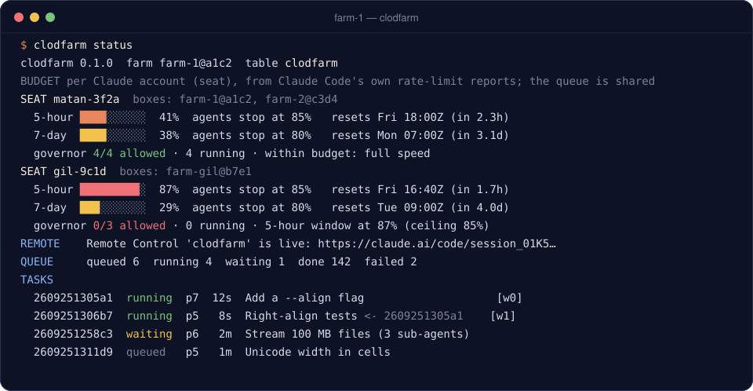
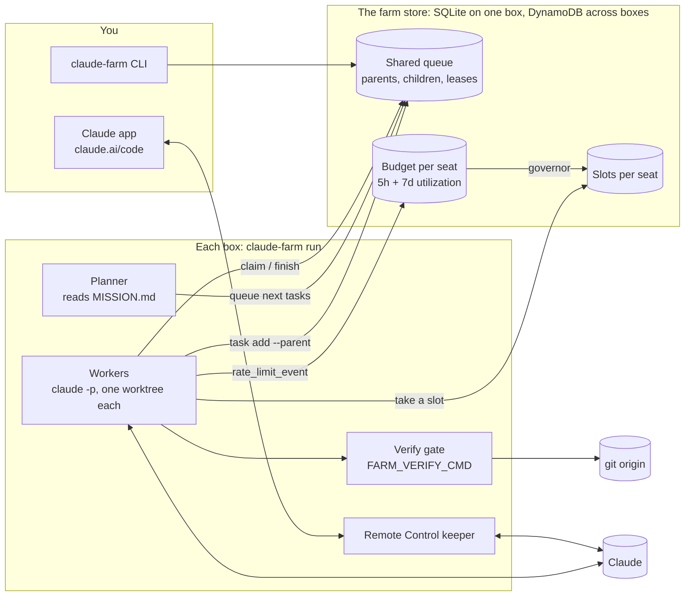

<p align="center">
  
</p>

<p align="center">
  <a href="#quick-start"><b>Quick start</b></a> ·
  <a href="#how-it-works"><b>How it works</b></a> ·
  <a href="#multiple-deployments-one-farm"><b>Multi-seat</b></a> ·
  <a href="docs/"><b>Docs</b></a> ·
  <a href="#faq"><b>FAQ</b></a>
</p>

<p align="center">
  <a href="https://github.com/matank001/claude-farm/actions/workflows/ci.yml"></a>
  <a href="LICENSE"></a>
  
  
  
  
</p>

<h3 align="center">Your Claude Code agents keep working while you sleep, and stop before they eat your week.</h3>

**claude-farm** runs Claude Code around the clock in a container.
- **You steer it from the Claude app on your phone.**
- **Agents split big jobs into parallel sub-agents.**
- **A budget governor paces everything on your account's real 5-hour and weekly usage.**

Add more boxes, or your teammates' own accounts, and they share one queue while each account keeps its own budget.

<p align="center">
  
  <br><sub><i>One farm, two seats. Gil's seat is near its 5-hour ceiling and paused; the work flows to Matan's seat. (Illustrative output.)</i></sub>
</p>

<table>
<tr>
<td width="25%" valign="top"><b>01 · Install</b><br>One line on any box with Docker, or one command on AWS with no open ports.</td>
<td width="25%" valign="top"><b>02 · Log in from anywhere</b><br><code>claude-farm login</code> prints a URL. Approve it on your phone and paste the code.</td>
<td width="25%" valign="top"><b>03 · Give it a mission</b><br><code>claude-farm mission "..."</code>, queue tasks, or just talk to it in the Claude app.</td>
<td width="25%" valign="top"><b>04 · It keeps going</b><br>It plans, splits, tests and merges, and paces itself on your real limits.</td>
</tr>
</table>

## Why claude-farm

A `while true; claude -p` loop gets you an agent that forgets what it did, can't split work, can't be reached from
your phone, and runs until it hits the wall and locks you out of your own Claude. claude-farm is the missing
operations layer:

| | |
|---|---|
| 🌙 **Always on** | Workers restart, leases expire, crashed runs are retried, and timed-out runs continue in their own session. |
| 📱 **Steer it from your phone** | `claude remote-control` stays up, so the farm is a session in the Claude app and at claude.ai/code. |
| 🌱 **Sub-agents that merge** | `claude-farm task add --parent $FARM_TASK_ID` fans out. Each child works in its own git worktree, and the parent is resumed *in its own session* to merge the results. |
| 🌕 **Paced on real usage** | Every run reports the account's actual 5-hour and weekly utilization (`rate_limit_event`). The governor paces the week, leaves you 20% by default, sleeps through rejections, and never touches paid overage. |
| 👥 **Many boxes, many seats** | Point containers on several accounts at one table: one queue, one repo, a separate budget per account. |
| ✅ **Nothing lands untested** | `FARM_VERIFY_CMD` runs your tests on the rebased branch, and a failing check sends the agent back to fix it. |
| 🧭 **Never runs dry** | When the queue empties, a planner reads `MISSION.md` and the work so far, then queues the next concrete tasks. |
| 🔔 **Tells you when it matters** | Notifications to ntfy, Slack or Discord for failures, a tripped circuit breaker, usage limits, and "nothing left to do". |

No web dashboard on purpose: the Claude app, a CLI and the logs are the whole interface.

## Quick start

One container, no config, no database to run:

```bash
curl -fsSL https://raw.githubusercontent.com/matank001/claude-farm/main/scripts/install.sh | sh
```

It pulls the image, starts `claude-farm` (restarting on reboot), and opens the login: a URL you approve on any
device, then paste the code back. Then give it something to do:

```bash
docker exec claude-farm claude-farm mission "Build csv2md: a CLI that converts CSV to Markdown tables, with tests."
docker exec claude-farm claude-farm status
```

Or open **Claude app → Code → claude-farm** and just talk to it.

<details>
<summary><b>Prefer plain Docker, or Compose?</b></summary>

```bash
docker run -d --name claude-farm --restart unless-stopped \
  -v claude-farm_claude-home:/home/farm/.claude -v claude-farm_workspace:/workspace \
  ghcr.io/matank001/claude-farm
docker exec -it claude-farm claude-farm login
```

Or clone the repo and run `docker compose up -d`. A `.env` is optional: copy `.env.example` to change any setting.
Either way the farm's state lives in a SQLite file inside the workspace volume, so there's nothing else to run.
</details>

> [!TIP]
> Point it at a real repo with `FARM_REPO_URL` (plus a deploy key), set `FARM_VERIFY_CMD="pytest -q"`, and write a
> `MISSION.md`. The farm clones the repo, keeps the agents busy, and pushes `main` only when your tests pass.

## Deploy

| | What you get |
|---|---|
| [**Single deployment**](#single-deployment) | One box, one Claude account. Everything in one container. |
| [**Multiple deployments, one farm**](#multiple-deployments-one-farm) | Several boxes on your account or teammates' own accounts: one queue and one repo, each account paced on its own budget. |

You can start single and add boxes later. A new box simply joins the first one's table.

### Single deployment

**Any Docker host:** run the one-line installer on the server (`ssh myserver`, then the `curl … | sh` above). Or
start it there and log in from your laptop with `ssh -t myserver docker exec -it claude-farm claude-farm login`.

**AWS** (about 10 minutes, one box, no inbound ports):

```bash
deploy/aws/deploy.sh up       # CloudFormation: VPC, EC2 t4g.medium, DynamoDB table, IAM role limited to that table
deploy/aws/deploy.sh login    # over SSM Session Manager: URL + code, same as above
deploy/aws/deploy.sh status   # also: logs · shell · down
```

You need the AWS CLI v2 and the
[Session Manager plugin](https://docs.aws.amazon.com/systems-manager/latest/userguide/session-manager-working-with-install-plugin.html).
Remote Control, the Claude API and SSM all use outbound HTTPS only. See [docs/deploy-aws.md](docs/deploy-aws.md).

### Multiple deployments, one farm

A single box keeps its farm in a local SQLite file. To spread one farm over several boxes, the boxes share a
**DynamoDB table** instead (`FARM_STORE=dynamodb`; the AWS deploy sets it for you).
- **Shared:** every box pointed at that table shares **one queue** and **one git repo**.
- **Per account:** each box is paced on the budget of the Claude account it's logged in to (its **seat**). When one
  seat hits a limit, only its boxes pause.

**You need:**
- real DynamoDB (the AWS deploy creates it);
- a shared git repo every box can push to (`--workspace-repo` / `FARM_REPO_URL`); task branches travel through it.

```bash
# box 1 creates the farm (table "claude-farm")
deploy/aws/deploy.sh up --workspace-repo git@github.com:you/repo.git && deploy/aws/deploy.sh login

# more boxes on your account: more room to run, never extra usage
STACK=farm-2 deploy/aws/deploy.sh up --table claude-farm --workspace-repo git@github.com:you/repo.git
STACK=farm-2 deploy/aws/deploy.sh login

# a teammate's box, logged in to THEIR account: a second seat, with its own budget
STACK=farm-gil deploy/aws/deploy.sh up --table claude-farm --workspace-repo git@github.com:you/repo.git
STACK=farm-gil deploy/aws/deploy.sh login

claude-farm budget   # every seat: usage bars, its boxes, what it may run right now
```

- A sub-task can run on Gil's box and be merged by its parent on yours.
- A resumed parent waits a few minutes for the box that holds its conversation.

<details>
<summary><b>Join from any Docker host, or add work from your laptop</b></summary>

**A Docker host joining an existing farm:**
1. In `.env`, set `FARM_STORE=dynamodb`, `FARM_TABLE=<table>`, `AWS_REGION=<region>` and
   `FARM_REPO_URL=<shared repo>`.
2. Give the box AWS credentials for the table.
3. Run `docker compose up -d && docker exec -it claude-farm claude-farm login`.

**Queue work from your laptop without running a worker:**

```bash
pip install git+https://github.com/matank001/claude-farm
export FARM_STORE=dynamodb FARM_TABLE=claude-farm AWS_REGION=<region>   # plus AWS credentials for the table
claude-farm task add "Refactor the parser" --prompt "..." && claude-farm status
```
</details>

Full guide: [docs/multi-seat.md](docs/multi-seat.md).

## How it works



1. **A worker** asks the governor how many agents *its seat* may run right now, takes one of that seat's slots,
   claims the highest-priority task (an atomic conditional write, with a lease it keeps renewing), and starts
   `claude -p --output-format stream-json` in the task's own git worktree.
2. **While it runs**, every `rate_limit_event` updates that seat's budget, so all its boxes react within seconds.
3. **When it ends:**
   - **Waiting on children:** the parent stays open and is resumed in the same session when they finish.
   - **A sub-task:** its branch waits for the parent to merge it.
   - **A top-level task:** it's rebased onto `main`, `FARM_VERIFY_CMD` runs, and it fast-forwards `main` only if
     the check passes. Otherwise the agent is resumed with the failure output.
4. **When the queue is empty** and there's budget, one planner run turns `MISSION.md` into the next tasks, and backs
   off when there's nothing useful to do.

<details>
<summary><b>The budget governor, in detail</b></summary>

Utilization comes from Claude Code itself and covers the **whole account**, including your own chats, so the farm
backs off when you use Claude. Per seat:

- **Weekly window:** agents stop at `FARM_WEEKLY_TARGET` (80%). Before that, a pace line
  (`target × fraction of the week elapsed + 5%`) spreads the week out. Ahead of the line the governor slows down or
  stops until the line catches up; behind it, it runs at full concurrency.
- **5-hour window:** never past `FARM_FIVE_HOUR_CEILING` (85%). The pace is loose, so bursts are fine.
- **Rejected or paid overage:** that seat stops until the reset time Claude reported.
- **API key:** no windows apply. It stops for the day at `FARM_DAILY_BUDGET_USD`.

It's a pure, unit-tested function: [claude_farm/governor.py](claude_farm/governor.py) ·
[docs/budget.md](docs/budget.md).
</details>

More: [architecture](docs/architecture.md) · [what agents are told](docs/agents.md) · [login options](docs/auth.md) ·
[security](docs/security.md) · [how it's tested](docs/testing.md).

## How it compares

|  | `while` loop | Single-loop runners (e.g. ralph, continuous-claude) | **claude-farm** |
|---|:---:|:---:|:---:|
| Runs unattended, survives crashes | ❌ | ✅ | ✅ |
| Parallel agents | ❌ | via separate instances | ✅ shared queue |
| Sub-agent tree, parent resumes in its own session | ❌ | ❌ | ✅ |
| Paces on the real 5-hour **and** weekly utilization | ❌ | waits out limits | ✅ per seat |
| Several boxes and accounts in one farm | ❌ | ❌ | ✅ |
| Merge only when tests pass | ❌ | ✅ (continuous-claude) | ✅ |
| Steer it from the Claude app | ❌ | ❌ | ✅ Remote Control |
| Cloud deploy with no open ports | ❌ | ❌ | ✅ |

Both runners are great at what they do, and we learned from them. See [related projects](#related-projects).

## Logging in

Your login stays in the container's `claude-home` volume. claude-farm never reads or prints it.

| | How | Good for |
|---|---|---|
| **A. Remote login** | `claude-farm login`: a URL on any device, then paste the code back | servers (the default) |
| **B. Token** | `claude setup-token` on your laptop, then `CLAUDE_CODE_OAUTH_TOKEN=...` in `.env` | headless workers, CI |
| **C. Existing profile** | mount a Linux `~/.claude` (macOS keeps it in the Keychain: use A or B) | moving a box |
| **D. API key** | `ANTHROPIC_API_KEY` + `FARM_DAILY_BUDGET_USD` | teams, services, pay per token |

Details and caveats: [docs/auth.md](docs/auth.md).

## Commands

| Command | |
|---|---|
| `claude-farm status` | seats, queue, workers, running tasks, the Remote Control link |
| `claude-farm budget [--refresh]` | every seat's usage and what the governor allows it now |
| `claude-farm task add TITLE --prompt ... [--parent ID] [--priority 0-9]` | queue work (agents use the same command) |
| `claude-farm task list / show / cancel / retry` | inspect and manage tasks |
| `claude-farm mission [TEXT]` | show or set `MISSION.md`, which the planner keeps the agents busy with |
| `claude-farm events [-f]` | the event log: claims, merges, checks, pauses, limits |
| `claude-farm pause [reason]` / `resume` | stop and restart new work on every box |
| `claude-farm login / whoami / doctor` | login and a setup check |

Every command takes `--json`.

<details>
<summary><b>Configuration</b> (all environment variables; <a href=".env.example">.env.example</a> documents every one)</summary>

| Variable | Default | |
|---|---|---|
| `FARM_MAX_WORKERS` | `3` | parallel agents per box (upper bound; the governor decides) |
| `FARM_MODEL` / `FARM_EFFORT` | `opus` / default | model and effort for every agent |
| `FARM_WEEKLY_TARGET` | `0.80` | agents stop at 80% of the weekly window |
| `FARM_FIVE_HOUR_CEILING` | `0.85` | max share of a 5-hour window |
| `FARM_DAILY_BUDGET_USD` | `0` | API-key mode: daily cap (0 = none) |
| `FARM_REPO_URL` | *(empty)* | repo to work in (required for more than one box) |
| `FARM_VERIFY_CMD` | *(empty)* | check that must pass before landing, e.g. `pytest -q` |
| `FARM_NOTIFY_URL` | *(empty)* | ntfy, Slack or Discord webhook |
| `FARM_STALL_THRESHOLD` | `5` | failed runs in a row that pause the farm |
| `FARM_REMOTE_CONTROL` | `1` | keep a Remote Control session up |
| `FARM_PERMISSION_MODE` | `bypassPermissions` | the container is the sandbox ([security](docs/security.md)) |
| `FARM_MISSION` | *(empty)* | the mission, if you'd rather set it at start than with `claude-farm mission` |
| `FARM_STORE` | `sqlite` | `dynamodb` to share one farm across boxes and accounts (setting `FARM_TABLE` implies it) |
| `FARM_TABLE` / `FARM_SEAT` | `claude-farm` / from login | which DynamoDB farm to join / override the seat name |
</details>

## FAQ

<details>
<summary><b>Is this allowed?</b></summary>

claude-farm drives the official Claude Code CLI, headless mode and Remote Control as documented. On a subscription
it's meant for **your own** projects, on your own login. Anthropic's consumer terms say plan limits assume ordinary,
individual use, and they forbid reselling or intermediating Claude usage. So:
- don't run it as a service for others on a subscription;
- don't share logins;
- for people working together, use Team or Enterprise seats, each person on their own login;
- for commercial workloads, use an API key.

claude-farm never shares or rotates logins, and it paces every seat well under its limits. Read the current
[Consumer Terms](https://www.anthropic.com/legal/consumer-terms) and [Usage Policy](https://www.anthropic.com/legal/aup)
yourself; this isn't legal advice.
</details>

<details>
<summary><b>Will it lock me out of my own Claude?</b></summary>

That's what the governor is for. By default agents stop at 80% of your week and 85% of any 5-hour window, and the
numbers include your own usage, so the farm backs off when you're working.
</details>

<details>
<summary><b>What does it cost?</b></summary>

On a subscription, nothing beyond your plan. Locally or on your own server it's free: a single box needs no
database. The AWS box is roughly $25/month for a t4g.medium, plus cents of DynamoDB (an estimate; check AWS pricing).
</details>

<details>
<summary><b>Is it safe to give agents a shell?</b></summary>

They run as an unprivileged user **inside the container**. Mount only what they may change, give git a deploy key
for one repo, and consider `FARM_PERMISSION_MODE=auto`. A prompt is not a security boundary: read
[docs/security.md](docs/security.md).
</details>

<details>
<summary><b>Does it work with an API key, Bedrock or Vertex?</b></summary>

API keys: yes, with a daily dollar cap instead of subscription pacing. Bedrock and Vertex should work through Claude
Code's own environment variables but aren't tested yet. PRs welcome.
</details>

## Related projects

- [ralph-claude-code](https://github.com/frankbria/ralph-claude-code) is a hardened single loop with a circuit
  breaker and exit detection. From its bug history we took three rules:
  - never trust the agent's text for limit detection;
  - a timeout is not a limit;
  - keep progress after a timeout.
- [continuous-claude](https://github.com/AnandChowdhary/continuous-claude) is a loop that opens a PR per iteration
  and merges only when CI passes. That's the idea behind `FARM_VERIFY_CMD`.
- [sleepless-agent](https://github.com/context-machine-lab/sleepless-agent) is a 24/7 daemon with a task queue and
  Slack control.
- Several small images keep `claude remote-control` running in a container.

claude-farm is the first open piece of **Pluribus**, an experiment in running a small company with a swarm of
Claude agents. This repo is the engine that keeps a swarm like that working.

## Contributing

Issues and PRs welcome. Start with [CONTRIBUTING.md](CONTRIBUTING.md). The whole loop is tested without a
subscription, using a fake `claude` that speaks the stream-json protocol:

```bash
python3 -m venv .venv && .venv/bin/pip install -e ".[test]" && .venv/bin/pytest
```

Security issues: see [SECURITY.md](SECURITY.md).

## License

[MIT](LICENSE). claude-farm is an independent open-source project, not affiliated with or endorsed by Anthropic.
"Claude" and "Claude Code" are trademarks of Anthropic, PBC.
