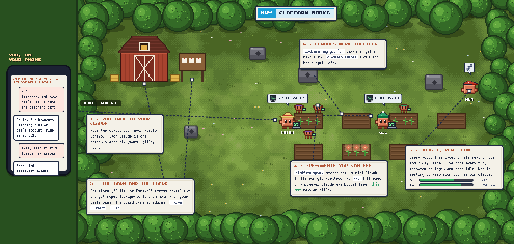

<p align="center">
  <a href="assets/demo-10s.mp4"></a>
</p>

<p align="center">
  <a href="#quick-start"><b>Quick start</b></a> ·
  <a href="#how-it-works"><b>How it works</b></a> ·
  <a href="#multiple-deployments-one-farm"><b>Multi-seat</b></a> ·
  <a href="docs/"><b>Docs</b></a> ·
  <a href="#faq"><b>FAQ</b></a>
</p>

<p align="center">
  <a href="https://github.com/matank001/clodfarm/actions/workflows/ci.yml"></a>
  <a href="LICENSE"></a>
  
  
  
  
</p>

<h3 align="center">Your Claude Code agents keep working while you sleep, and stop before they eat your week.</h3>

**clodfarm** (say it out loud) is a farm of Claude Code agents running around the clock in a container. A clod
is a lump of soil, and this is where your agents grow.
- **You talk to your Claude from the Claude app on your phone.** It does the work, or starts sub-agents for it.
- **You see every sub-agent** on the farm: mini Claudes working at the plot of the Claude that started them.
- **Claudes work together:** each one is a person's own account. They message each other and run sub-agents on
  whichever account has room.
- **Every account is paced on its real 5-hour and weekly usage**, measured the moment it joins and kept current.
- **Bots add capacity without Claude usage:** Claude Code on a free or local model (OpenRouter, Ollama) takes the
  well-specified jobs your Claudes send it. See [docs/bots.md](docs/bots.md).

<p align="center">
  
</p>

<p align="center">
  
</p>

<a name="why-clodfarm"></a>
<h2></h2>

A `while true; claude -p` loop forgets what it did, can't split work, can't be reached from your phone, and burns
through your limits. clodfarm is the operations layer it's missing:

| | |
|---|---|
|  **Always on** | Crashes, restarts and timeouts don't lose work. Claudes come back and pick up where they left off. |
|  **Talk to it from your phone** | Every Claude is a session in your Claude app. Ask for work from anywhere. |
|  **Sub-agents you can see** | Big jobs split into sub-agents, each on its own branch, and you watch them work. |
|  **Never eats your week** | Paced on your real 5-hour and weekly usage. It leaves you 20% and never pays overage. |
|  **Claudes that work together** | Teammates' Claudes message each other and run work on whoever has budget left. |
|  **Nothing lands untested** | Work reaches main only when your tests pass. |
|  **Schedules** | "Every weekday at 9, triage new issues." Cron, intervals or one-offs. |
|  **Dashboards** | The Claudes keep live pages that show what is improving ([docs](docs/dashboards.md)). |
|  **A browser, logged in** | Log in to a site once in the farm's browser (LinkedIn, an admin panel) and every Claude works there as you, in the window you watch ([docs](docs/browser.md)). |
|  **Slack** | DM or @mention the farm and a sub-agent answers in the thread. Two-minute setup ([docs](docs/slack.md)). |
|  **Claude Code on your laptop** | Connect over MCP and hand the farm work without leaving your editor. |
|  **Builds apps on AWS (optional)** | The Claudes ship their own serverless apps inside a fenced role with a hard budget cap ([details](#let-the-farm-build-apps-on-aws-optional)). |
|  **Many boxes, many seats** | One farm and one repo across machines and accounts, each on its own budget. |
|  **Tells you when it matters** | Failures and usage limits go to ntfy, Slack or Discord. |
|  **A farm you can watch** | Every Claude, its sub-agents, usage and tools at a glance, in your browser. |

You talk to your Claude in the Claude app; the farm UI shows who is working on what; the Claudes and you use the
same CLI.

<a name="quick-start"></a>
<h2></h2>

One container, no config, no database to run:

```bash
curl -fsSL https://raw.githubusercontent.com/matank001/clodfarm/main/scripts/install.sh | sh
```

It pulls the image, starts `clodfarm` (restarting on reboot), and opens the login: a URL you approve on any
device, then paste the code back. Then open **Claude app → Code → [clodfarm] clodfarm** on your phone and just talk to it:
"add CSV export to the report page", "have gil's Claude review it", "every morning at 9, triage new issues".
Or from a shell:

```bash
docker exec clodfarm clodfarm spawn "Add CSV export" --prompt "Add CSV export to the report page, with tests."
docker exec clodfarm clodfarm status
```

The farm UI is at **http://localhost:8080**
(see [docs/ui.md](docs/ui.md)): the password is printed once in `docker logs clodfarm`, or set `FARM_UI_PASSWORD`.
From the UI you can also log the farm in: tap the egg, open the Claude login link and paste the code back.

<details>
<summary><b>Prefer plain Docker, or Compose?</b></summary>

```bash
docker run -d --name clodfarm --restart unless-stopped \
  -v clodfarm_claude-home:/home/farm/.claude -v clodfarm_workspace:/workspace \
  ghcr.io/matank001/clodfarm
docker exec -it clodfarm clodfarm login
```

Or clone the repo and run `docker compose up -d`. A `.env` is optional: copy `.env.example` to change any setting.
Either way the farm's state lives in a SQLite file inside the workspace volume, so there's nothing else to run.
</details>

> [!TIP]
> Point it at a real repo with `FARM_REPO_URL` (plus a deploy key) and set `FARM_VERIFY_CMD="pytest -q"`. The farm
> clones the repo, and every sub-agent's work lands on `main` only when your tests pass.

<a name="connect-claude-code-on-your-computer"></a>
<h2></h2>

The farm is a remote MCP server, so the Claude Code on your laptop can see the farm, start sub-agents on it and
message its Claudes:

```bash
claude mcp add --transport http --scope user farm http://localhost:8080/mcp   # or https://<your farm>/mcp
```

Run `/mcp` in Claude Code and sign in. The farm's own page asks for its password and a name for your computer, and
Claude Code gets a token for this farm only (OAuth 2.1 + PKCE; `clodfarm disconnect` ends it). Then just ask:
"what's the farm doing?", "have the farm add CSV export, on gil", "tell noa the release is out".
See [docs/mcp.md](docs/mcp.md).

<a name="deploy"></a>
<h2></h2>

| | What you get |
|---|---|
| [**Single deployment**](#single-deployment) | One box, one Claude account. Everything in one container. |
| [**Multiple deployments, one farm**](#multiple-deployments-one-farm) | Several boxes on your account or teammates' own accounts: one farm and one repo, each account paced on its own budget. |
| [**+ Apps role** (optional)](#let-the-farm-build-apps-on-aws-optional) | Add-on for either one: the Claudes create and run their own serverless apps on AWS, fenced by a permissions boundary and a monthly budget. |

You can start single and add boxes later. A new box simply joins the first one's table.

### Single deployment

**Any Docker host:** run the one-line installer on the server (`ssh myserver`, then the `curl … | sh` above). Or
start it there and log in from your laptop with `ssh -t myserver docker exec -it clodfarm clodfarm login`.

**AWS** (about 10 minutes, one box, no inbound ports):

```bash
deploy/aws/deploy.sh up       # CloudFormation: VPC, EC2 t4g.medium, DynamoDB table, IAM role limited to that table
deploy/aws/deploy.sh login    # over SSM Session Manager: URL + code, same as above
deploy/aws/deploy.sh status   # also: logs · shell · down
```

You need the AWS CLI v2 and the
[Session Manager plugin](https://docs.aws.amazon.com/systems-manager/latest/userguide/session-manager-working-with-install-plugin.html).
Remote Control, the Claude API and SSM all use outbound HTTPS only. See [docs/deploy-aws.md](docs/deploy-aws.md).

### Let the farm build apps on AWS (optional)

The plain deployment above gives the agents **no** AWS access beyond the farm's own table, and that stays the default.
If you want your Claudes to ship their own apps (a landing page, an API, a small SaaS), add the apps role:

```bash
deploy/aws/deploy.sh apps-role --email you@example.com --budget 50              # same AWS account as the farm
APPS_PROFILE=my-apps-account deploy/aws/deploy.sh apps-role --email you@example.com \
  --budget 50 --domain apps.example.com --regions us-east-1,eu-central-1         # recommended: an account of its own
deploy/aws/deploy.sh apps-down                                                  # switch it off again
```

It deploys [deploy/aws/apps-role.yaml](deploy/aws/apps-role.yaml), lets the farm box assume the new role, and restarts
the farm with `FARM_AWS_APPS_*` set (the farm stack itself isn't touched). From then on every Claude knows (it's in their
guide) that `aws --profile apps ...` runs as that role, and how to deploy.

| Fence | What it does |
|---|---|
| **Serverless only** | Lambda, API Gateway, DynamoDB, S3, CloudFront, ACM, Route 53, CloudWatch, EventBridge, SQS, SNS, Step Functions, Cognito, Bedrock and friends. No EC2, RDS or containers. |
| **Permissions boundary** | Every role the farm creates must be named `farm-app-*` and carry the boundary, so app roles can never use IAM, billing or the account. The farm can't give itself more rights. |
| **Budget lock** | A monthly AWS Budget (`--budget`, USD). Alerts at 50% and 80%; at 100% of actual spend AWS attaches a deny-all to the role by itself. Running apps keep serving. |
| **Hard denies** | No IAM users or access keys, no email (SES), no domain purchases, no Marketplace or Savings Plans, and no changes to the stack that made the role. |
| **Optional** | `--domain` creates a Route 53 zone for `<app>.<domain>`; `--regions` limits where it deploys. |

**Use a separate AWS account** for the apps (`APPS_PROFILE`, e.g. a new account in your AWS Organization): then nothing
the farm deploys can reach anything else you run, and closing the account removes it all. An
[SCP](docs/deploy-aws.md#an-account-of-its-own-recommended) on that account makes the fences hold even against a
mistake in IAM. More in [docs/deploy-aws.md](docs/deploy-aws.md#let-the-farm-build-apps-on-aws-optional).

### Multiple deployments, one farm

A single box keeps its farm in a local SQLite file. To spread one farm over several boxes, the boxes share a
**DynamoDB table** instead (`FARM_STORE=dynamodb`; the AWS deploy sets it for you).
- **Shared:** every box pointed at that table is **one farm** (sub-agents, messages, schedules) with **one git repo**.
- **Per account:** each box is paced on the budget of the Claude account it's logged in to (its **seat**). When one
  seat hits a limit, only its boxes pause.

**You need:**
- real DynamoDB (the AWS deploy creates it);
- a shared git repo every box can push to (`--workspace-repo` / `FARM_REPO_URL`); sub-agent branches travel through it.

```bash
# box 1 creates the farm (table "clodfarm")
deploy/aws/deploy.sh up --workspace-repo git@github.com:you/repo.git && deploy/aws/deploy.sh login

# more boxes on your account: more room to run, never extra usage
STACK=farm-2 deploy/aws/deploy.sh up --table clodfarm --workspace-repo git@github.com:you/repo.git
STACK=farm-2 deploy/aws/deploy.sh login

# a teammate's box, logged in to THEIR account: a second seat, with its own budget
STACK=farm-gil deploy/aws/deploy.sh up --table clodfarm --workspace-repo git@github.com:you/repo.git
STACK=farm-gil deploy/aws/deploy.sh login

clodfarm budget   # every seat: usage bars, its boxes, what it may run right now
```

- A sub-agent can run on Gil's box and be merged by its parent on yours.
- A resumed parent waits a few minutes for the box that holds its conversation.

<details>
<summary><b>Join from any Docker host, or start sub-agents from your laptop</b></summary>

**A Docker host joining an existing farm:**
1. In `.env`, set `FARM_STORE=dynamodb`, `FARM_TABLE=<table>`, `AWS_REGION=<region>` and
   `FARM_REPO_URL=<shared repo>`.
2. Give the box AWS credentials for the table.
3. Run `docker compose up -d && docker exec -it clodfarm clodfarm login`.

**Start a sub-agent from your laptop without running a box:**

```bash
pip install git+https://github.com/matank001/clodfarm
export FARM_STORE=dynamodb FARM_TABLE=clodfarm AWS_REGION=<region>   # plus AWS credentials for the table
clodfarm spawn "Refactor the parser" --prompt "..." && clodfarm status
```
</details>

Full guide: [docs/multi-seat.md](docs/multi-seat.md).

<a name="how-it-works"></a>
<h2></h2>

The picture at the top, step by step:

1. **You talk to your Claude** in the Claude app (Remote Control). Every Claude on the farm is one person's
   account, kept reachable by its own `clodfarm run`.
2. **It starts sub-agents** with `clodfarm spawn`: a headless `claude -p` in its own git worktree, shown on the
   farm as a mini Claude next to it. Any Claude whose account has budget free runs it, unless `--on <name>` pins
   it. A sub-agent's own sub-agents are its children; it ends its run and is resumed *in its own session* with their
   results to merge them.
3. **The budget governor** decides, per account, how many sub-agents may run right now. Usage comes from Claude
   Code's own `rate_limit_event`s during every run, from a one-word probe the moment a Claude logs in, and again
   whenever it has been idle for `FARM_USAGE_REFRESH` seconds.
4. **Claudes talk to each other in real time.** On one box they use Claude Code's own messaging (`SendMessage`): it
   reaches a session at its next tool call and wakes an idle one. `clodfarm msg <name or sub-agent id> "..."`
   reaches anyone, on any box: it waits in the store and is handed over by the farm's hooks after the recipient's
   next batch of tool calls or before it finishes, wakes an idle conversation, `--urgent` interrupts a running
   sub-agent, and `--wake` starts someone for mail nobody read. `clodfarm agents` shows how much of its usage each
   Claude has used, so one that is running high sends work elsewhere.
5. **When a sub-agent finishes,** its branch is rebased onto `main`, `FARM_VERIFY_CMD` runs, and `main` moves only
   if the check passes. Otherwise the sub-agent is resumed with the failure output.
6. **Schedules** start sub-agents on a cron line (in your time zone), every N minutes or once at a time. Every box
   checks; each firing is claimed atomically, so it runs once.

Everything lives in one store: a SQLite file on one box, or a DynamoDB table shared by several boxes and accounts.

<details>
<summary><b>The budget governor, in detail</b></summary>

Utilization comes from Claude Code itself and covers the **whole account**, including your own chats, so the farm
backs off when you use Claude. Per seat:

- **Weekly window:** agents stop at `FARM_WEEKLY_TARGET` (80%). Before that, a pace line
  (`target × fraction of the week elapsed + 5%`) spreads the week out. Ahead of the line the governor slows down or
  stops until the line catches up; behind it, it runs at full concurrency.
- **5-hour window:** never past `FARM_FIVE_HOUR_CEILING` (85%). The pace is loose, so bursts are fine.
- **Rejected or paid overage:** that seat stops until the reset time Claude reported.
- **API key:** no windows apply. It stops for the day at `FARM_DAILY_BUDGET_USD`.

It's a pure, unit-tested function: [clodfarm/governor.py](clodfarm/governor.py) ·
[docs/budget.md](docs/budget.md).
</details>

More: [architecture](docs/architecture.md) · [what agents are told](docs/agents.md) · [login options](docs/auth.md) ·
[security](docs/security.md) · [how it's tested](docs/testing.md).

<a name="how-it-compares"></a>
<h2></h2>

|  | `while` loop | Single-loop runners (e.g. ralph, continuous-claude) | **clodfarm** |
|---|:---:|:---:|:---:|
| Runs unattended, survives crashes |  |  |  |
| Parallel agents |  | via separate instances |  visible sub-agents |
| Sub-agent tree, parent resumes in its own session |  |  |  |
| Paces on the real 5-hour **and** weekly utilization |  | waits out limits |  per seat |
| Several boxes and accounts in one farm |  |  |  |
| Merge only when tests pass |  |  (continuous-claude) |  |
| Steer it from the Claude app |  |  |  Remote Control |
| Cloud deploy with no open ports |  |  |  |

Both runners are great at what they do, and we learned from them. See [related projects](#related-projects).

<a name="logging-in"></a>
<h2></h2>

Your login stays in the container's `claude-home` volume. clodfarm never reads or prints it.

| | How | Good for |
|---|---|---|
| **A. Remote login** | `clodfarm login`: a URL on any device, then paste the code back | servers (the default) |
| **B. Token** | `claude setup-token` on your laptop, then `CLAUDE_CODE_OAUTH_TOKEN=...` in `.env` | headless workers, CI |
| **C. Existing profile** | mount a Linux `~/.claude` (macOS keeps it in the Keychain: use A or B) | moving a box |
| **D. API key** | `ANTHROPIC_API_KEY` + `FARM_DAILY_BUDGET_USD` | teams, services, pay per token |

Details and caveats: [docs/auth.md](docs/auth.md).

<a name="commands"></a>
<h2></h2>

| Command | |
|---|---|
| `clodfarm status` | the Claudes, their budget, the links to talk to them, the sub-agents at work |
| `clodfarm agents` | every Claude on the farm and its usage (% used, like Claude's usage page) |
| `clodfarm budget [--refresh]` | every seat's usage and what the governor allows it now |
| `clodfarm spawn TITLE --prompt ... [--on NAME]` | start a sub-agent (the Claudes use the same command) |
| `clodfarm subagents [--all]` · `result ID [--wait]` · `cancel ID` · `retry ID` | follow and manage sub-agents |
| `clodfarm msg NAME\|ID TEXT [--urgent] [--wake]` · `inbox` | messages to a Claude or a sub-agent |
| `clodfarm sessions` · `session ID` | every Claude session on the farm, and its whole conversation |
| `clodfarm schedule add TITLE (--cron ... [--tz ...] \| --every 2h \| --at ...)` / `list` / `remove ID` | scheduled tasks |
| `clodfarm dashboard push NAME --file spec.json` / `push NAME --run CMD --every 1h` / `metric NAME KEY VALUE` / `list` / `show` / `refresh` / `remove` | dashboards at `/dashboards/<name>` |
| `clodfarm events [-f]` | the event log: sub-agents, merges, checks, messages, pauses, limits |
| `clodfarm connect` · `connections` · `disconnect ID` | Claude Code on your computer, over MCP ([docs/mcp.md](docs/mcp.md)) |
| `clodfarm pause [reason]` / `resume` | stop and restart new sub-agents on every box |
| `clodfarm login / whoami / doctor` | login and a setup check |

Every command takes `--json`.

<details>
<summary><b>Configuration</b> (all environment variables; <a href=".env.example">.env.example</a> documents every one)</summary>

| Variable | Default | |
|---|---|---|
| `FARM_MAX_WORKERS` | `3` | sub-agents one Claude may run at once (upper bound; the governor decides) |
| `FARM_NAME` / `FARM_CLAUDE_NAME` | `clodfarm` / from the login | the farm's name / its own Claude's name (default: the login email before `@`) |
| `FARM_USAGE_REFRESH` | `300` | re-measure an idle Claude's usage after this many seconds (0 = only from runs) |
| `FARM_TZ` | `UTC` | default time zone for `clodfarm schedule` |
| `FARM_MODEL` / `FARM_EFFORT` | `opus` / default | model and effort for every agent, and the default model of the sessions you open from the Claude app |
| `FARM_CLAUDE_UPDATE` | `3600` | update Claude Code to its newest release every this many seconds (0 = never), so new models arrive the day they ship |
| `FARM_WEEKLY_TARGET` | `0.80` | agents stop at 80% of the weekly window |
| `FARM_FIVE_HOUR_CEILING` | `0.85` | max share of a 5-hour window |
| `FARM_DAILY_BUDGET_USD` | `0` | API-key mode: daily cap (0 = none) |
| `FARM_REPO_URL` | *(empty)* | repo to work in (required for more than one box) |
| `FARM_VERIFY_CMD` | *(empty)* | check that must pass before landing, e.g. `pytest -q` |
| `FARM_NOTIFY_URL` | *(empty)* | ntfy, Slack or Discord webhook |
| `FARM_SLACK_BOT_TOKEN` / `FARM_SLACK_APP_TOKEN` | *(empty)* | give the farm work from Slack (easier: the UI's Slack button; [docs/slack.md](docs/slack.md)) |
| `FARM_SLACK_ALLOW` | *(empty)* | emails or Slack member IDs that may give it work (empty: every full member of the workspace) |
| `FARM_STALL_THRESHOLD` | `5` | failed runs in a row that pause the farm |
| `FARM_REMOTE_CONTROL` | `1` | keep a Remote Control session up |
| `FARM_PERMISSION_MODE` | `bypassPermissions` | the container is the sandbox ([security](docs/security.md)) |
| `FARM_STORE` | `sqlite` | `dynamodb` to share one farm across boxes and accounts (setting `FARM_TABLE` implies it) |
| `FARM_PUBLIC_URL` | *(from Host)* | the farm's public URL for MCP sign-in behind a proxy that rewrites Host, e.g. `https://clod.farm/team` |
| `FARM_TABLE` / `FARM_SEAT` | `clodfarm` / from login | which DynamoDB farm to join / override the seat name |
| `FARM_AWS_APPS_ROLE` | *(empty)* | optional apps role: the Claudes get `aws --profile apps` as this role (`deploy.sh apps-role` sets it and the `FARM_AWS_APPS_*` below) |
| `FARM_AWS_APPS_CREDENTIALS` | `Ec2InstanceMetadata` | where that profile's source credentials come from: `Ec2InstanceMetadata`, `EcsContainer` or `Environment` (any Docker host) |
</details>

<a name="faq"></a>
<h2></h2>

<details>
<summary><b>Is this allowed?</b></summary>

clodfarm drives the official Claude Code CLI, headless mode and Remote Control as documented. On a subscription
it's meant for **your own** projects, on your own login. Anthropic's consumer terms say plan limits assume ordinary,
individual use, and they forbid reselling or intermediating Claude usage. So:
- don't run it as a service for others on a subscription;
- don't share logins;
- for people working together, use Team or Enterprise seats, each person on their own login;
- for commercial workloads, use an API key.

clodfarm never shares or rotates logins, and it paces every seat well under its limits. Read the current
[Consumer Terms](https://www.anthropic.com/legal/consumer-terms) and [Usage Policy](https://www.anthropic.com/legal/aup)
yourself; this isn't legal advice.
</details>

<details>
<summary><b>Will it lock me out of my own Claude?</b></summary>

That's what the governor is for. By default agents stop at 80% of your week and 85% of any 5-hour window, and the
numbers include your own usage, so the farm backs off when you're working.
</details>

<details>
<summary><b>What does it cost?</b></summary>

On a subscription, nothing beyond your plan. Locally or on your own server it's free: a single box needs no
database. The AWS box is roughly $25/month for a t4g.medium, plus cents of DynamoDB (an estimate; check AWS pricing).
</details>

<details>
<summary><b>Is it safe to give agents a shell?</b></summary>

They run as an unprivileged user **inside the container**. Mount only what they may change, give git a deploy key
for one repo, and consider `FARM_PERMISSION_MODE=auto`. A prompt is not a security boundary: read
[docs/security.md](docs/security.md).
</details>

<details>
<summary><b>Does it work with an API key, Bedrock or Vertex?</b></summary>

API keys: yes, with a daily dollar cap instead of subscription pacing. Bedrock and Vertex should work through Claude
Code's own environment variables but aren't tested yet. PRs welcome.
</details>

<details>
<summary><b>Can it use other models, like free ones?</b></summary>

Yes, as **bots**: Claude Code on another model through any provider that speaks Anthropic's API (OpenRouter's free
models, a local Ollama, a LiteLLM gateway). They use no Claude usage, take only the sub-agents sent to them, and
your Claudes check their work. See [docs/bots.md](docs/bots.md).
</details>

<a name="related-projects"></a>
<h2></h2>

- [ralph-claude-code](https://github.com/frankbria/ralph-claude-code) is a hardened single loop with a circuit
  breaker and exit detection. From its bug history we took three rules:
  - never trust the agent's text for limit detection;
  - a timeout is not a limit;
  - keep progress after a timeout.
- [continuous-claude](https://github.com/AnandChowdhary/continuous-claude) is a loop that opens a PR per iteration
  and merges only when CI passes. That's the idea behind `FARM_VERIFY_CMD`.
- [sleepless-agent](https://github.com/context-machine-lab/sleepless-agent) is a 24/7 daemon with a task queue and
  Slack control.
- Several small images keep `claude remote-control` running in a container.

clodfarm is the first open piece of **Pluribus**, an experiment in running a small company with a swarm of
Claude agents. This repo is the engine that keeps a swarm like that working.

<a name="contributing"></a>
<h2></h2>

Issues and PRs welcome. Start with [CONTRIBUTING.md](CONTRIBUTING.md). The whole loop is tested without a
subscription, using a fake `claude` that speaks the stream-json protocol:

```bash
python3 -m venv .venv && .venv/bin/pip install -e ".[test]" && .venv/bin/pytest
```

Security issues: see [SECURITY.md](SECURITY.md).

<a name="license"></a>
<h2></h2>

[MIT](LICENSE). clodfarm is an independent open-source project, not affiliated with or endorsed by Anthropic.
"Claude" and "Claude Code" are trademarks of Anthropic, PBC.
