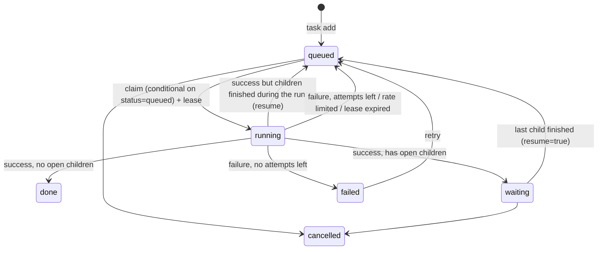

# Architecture

claude-farm is a small Python daemon (`claude-farm run`, about 1,500 lines with no dependencies beyond boto3) that
supervises Claude Code processes and keeps its state in a single DynamoDB table.

```
container (user "farm", tini as PID 1)
└── claude-farm run                       supervisor.py
    ├── remote-control keeper          `claude remote-control --name $FARM_NAME --spawn worktree`, restarted with back-off
    ├── worker w0..wN-1                one thread each, never more than FARM_MAX_WORKERS
    │     └── claude -p --output-format stream-json --verbose --append-system-prompt <farm guide> ...
    └── housekeeping                   re-queues tasks whose lease expired, prints a status line every 10 min
```

## Modules

| File | Responsibility |
|---|---|
| `governor.py` | Pure function `decide(snapshot, policy, now) -> Decision(workers, reason, pause_until)`. No I/O. |
| `store.py` | DynamoDB single-table access: tasks, runs, budget snapshot, slots, control switches, heartbeats, events. All state changes are conditional writes. |
| `runner.py` | Starts one `claude -p` process, streams its JSON events, collects the result, usage and `rate_limit_event`s, and enforces a timeout. |
| `supervisor.py` | The worker loop, the planner trigger, resume logic, git integration, the Remote Control keeper. |
| `gitops.py` | One worktree and branch per task; rebase onto main plus fast-forward; conflicts become tasks. |
| `prompts.py` | The farm guide every agent gets, the planner prompt and the resume prompt. |
| `auth.py` | Login detection, the waiting banner, onboarding and trust flags, the guide in `CLAUDE.md`. |
| `cli.py` | The `claude-farm` command, shared by humans and agents. |

## Data model (one table)

| PK | SK | What |
|---|---|---|
| `TASK#<id>` | `META` | A task: title, prompt, status, priority, parent, children, depth, attempts, session id, worktree, result. `GSI1PK = STATUS#<status>` and `GSI1SK = <9-priority>#<created>` make "next queued task" one index query. |
| `TASK#<id>` | `RUN#<ts>` | One agent run: duration, turns, output tokens, list-price cost, utilization before and after. |
| `BUDGET` | `LATEST` | Newest `rate_limit_event` snapshot. The write is conditional on `observed_at` being newer. |
| `SLOT` | `000..` | Account-wide concurrency slots with leases. |
| `CONTROL` | `GLOBAL` / `PLANNER` | The pause switch; planner single-flight and back-off. |
| `WORKER` | `<farm>/<worker>` | Heartbeats (TTL 1 day). |
| `EVENT#<day>` | `<ts>#<rand>` | Event log (TTL 30 days). |

Task IDs start with a timestamp, so they sort by creation time.

## Task lifecycle



**Resuming a parent:** a resumed parent runs `claude -p --resume <session_id>` in the same worktree, with a prompt
that lists every child's status and result. It keeps its whole conversation. If the session file is gone (a new
volume), it starts fresh with its original prompt plus the children's results.

**Why the parent ends its run instead of waiting:** a waiting agent would hold a slot, and with it the budget, while
doing nothing. Parents end their run and are re-queued when their children finish. Cycles are impossible because
depth is bounded by `FARM_MAX_DEPTH` (3).

## Git flow

- Each task gets `/workspace/.worktrees/<id>` on branch `farm/<id>`, cut from `main`. If the repo has an
  `origin`, `main` is pulled first.
- On success, anything left uncommitted is committed for the agent. The branch is rebased onto `main`, and `main`
  is fast-forwarded to it (under a lock, one merge at a time per box), then pushed if `origin` exists and
  `FARM_PUSH=1`.
- A rebase conflict aborts the rebase and queues a priority-8 "resolve merge conflict" task.
- Planner runs happen in the main checkout and are told not to change anything.
- Remote Control sessions spawned from the app use `--spawn worktree` too. The one Remote Control session
  pre-created in `/workspace/repo` sits on the main checkout, so commit there with care: the farm fast-forwards
  `main` underneath it.

Without a git repo in `/workspace/repo`, tasks run in `/workspace` with no isolation. The farm creates an empty repo
on first start, so that only happens if you remove it.

## Failure handling

| Failure | What happens |
|---|---|
| The agent process crashes or times out | The attempt counts. The task is re-queued until `max_attempts` (3), then marked `failed` with the output. |
| The container or box dies mid-run | The lease (5 min, renewed every ~100 s) expires. Housekeeping on any box re-queues the task. The slot lease expires too. |
| DynamoDB is briefly unreachable | Worker threads log and retry after 30 s. The event log never raises. |
| Remote Control exits | Restarted after 10 s, with exponential back-off up to 30 min if it keeps failing fast. |
| Usage limit | See [budget.md](budget.md): the attempt is handed back and the whole account pauses until the reset. |
| Logged out (token revoked) | Runs fail with auth errors. `claude-farm doctor` shows it. Log in again with `claude-farm login`. |

## Scaling out

Run the same image on more boxes with the same `FARM_TABLE` (and real DynamoDB). They share the queue, the
slots and the budget. `FARM_MAX_WORKERS` is per box, and the governor's cap is account-wide. Keep all boxes on
the **same** subscription: a table is one budget.

## What claude-farm deliberately doesn't do

- No web UI. The Claude app (Remote Control), the CLI and `docker logs` cover it.
- No multi-account pooling, no API-key fallback and no limit evasion.
- No outbound messages, payments or posting. Agents are told not to unless your mission says so, and nothing in
  claude-farm itself does any of it.
